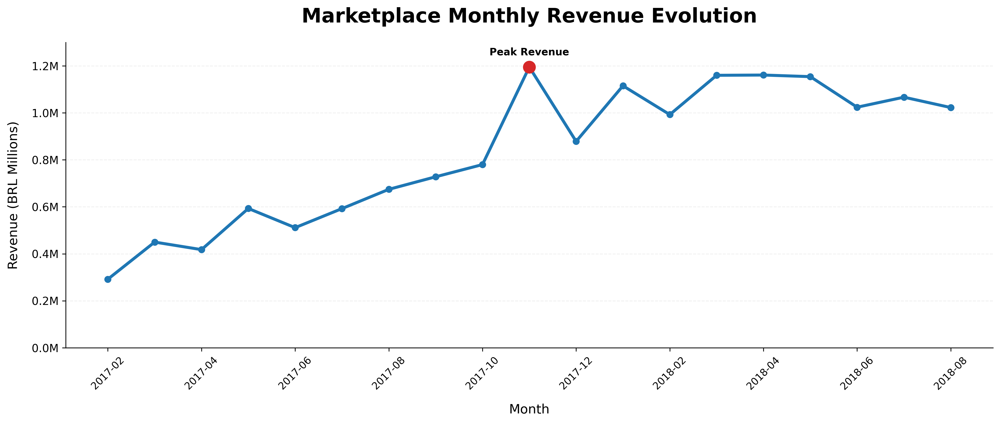
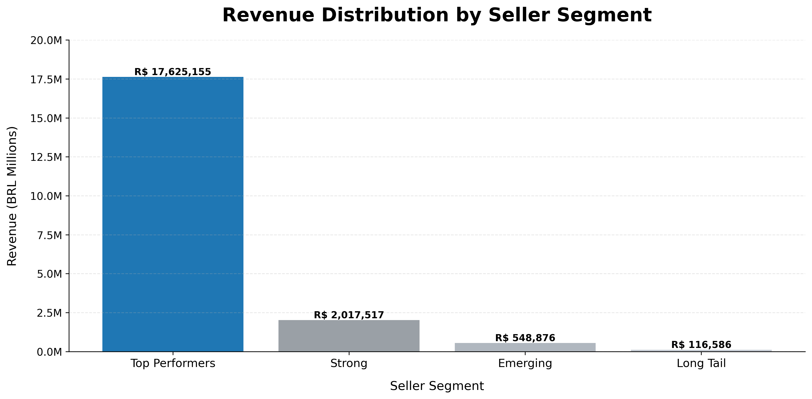
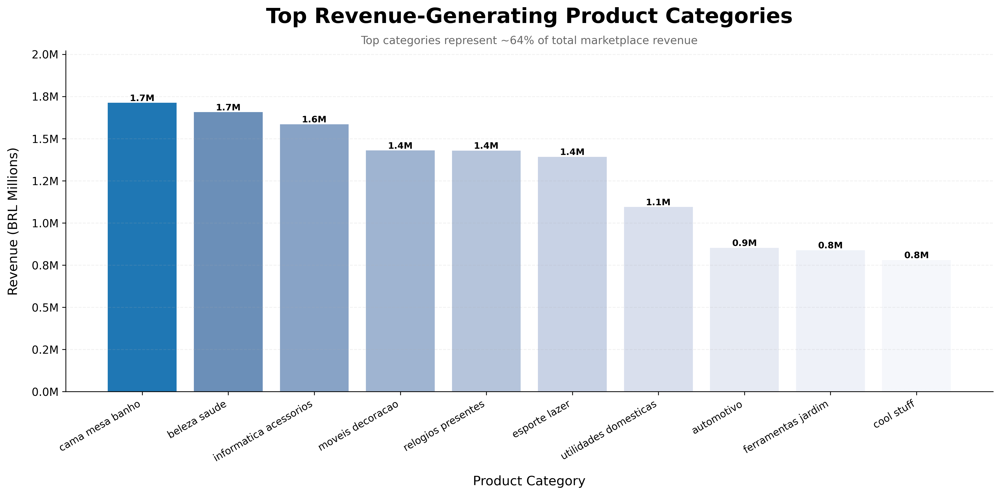
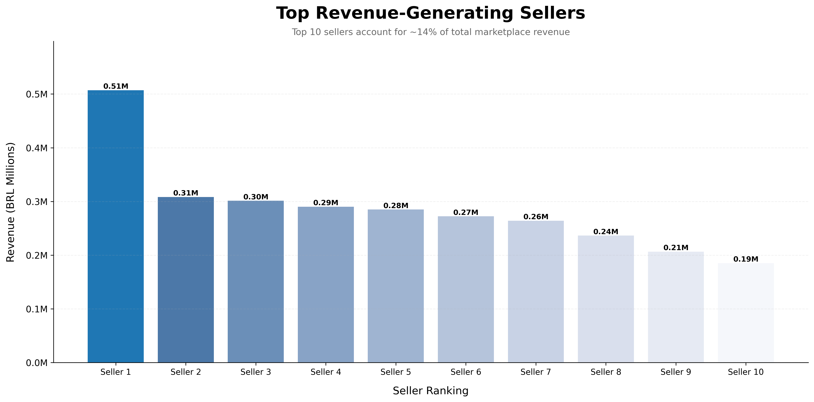

# 📊 Olist Revenue Intelligence

Análise estratégica de receita em marketplace com foco em concentração de sellers, dependência de categorias e geração de insights de negócio para tomada de decisão.

<br>


---

# 🇧🇷 Português | 🇺🇸 English

---

# ⚡ Executive Summary

## 🇧🇷 Português

Este projeto realiza uma análise de receita dentro do ecossistema de marketplace da Olist com foco em:

* concentração de sellers;
* dependência de categorias;
* riscos estruturais;
* oportunidades estratégicas de crescimento.

A análise mostrou que o marketplace possui forte dependência de um pequeno grupo de sellers de alta performance e de categorias dominantes, criando eficiência operacional, mas também riscos de concentração.

### Principais Descobertas

* 📌 Top Performers geram **86,79%** da receita total
* 📌 17,9% dos sellers representam **80,03%** da receita
* 📌 As 10 principais categorias representam **63,68%** da receita total
* 📌 `cama_mesa_banho` sozinha gera aproximadamente **R$ 1,7 milhão**
* 📌 Os 10 maiores sellers representam aproximadamente **14%** da receita do marketplace

---

## 🇺🇸 English

This project analyzes marketplace revenue concentration within the Olist ecosystem to identify seller dependency patterns, structural risks, and business growth opportunities.

### Key Findings

* Top Performers generate ~87% of total revenue
* 17.9% of sellers account for ~80% of marketplace revenue
* Top 10 categories represent ~64% of total revenue

---

# 🎯 Problema de Negócio | Business Problem

Como a receita do marketplace está distribuída entre sellers e categorias de produtos, e quais riscos estratégicos ou oportunidades de crescimento surgem dessa estrutura de concentração?

---

# ❓ Perguntas de Negócio Respondidas

* Quão concentrada é a receita do marketplace?
* Quais sellers sustentam a performance da plataforma?
* Quais categorias dominam a receita?
* O crescimento do marketplace é estável ou volátil?
* Quais riscos estratégicos existem na dependência de sellers?
* Como melhorar a sustentabilidade do ecossistema?

---

# 🏪 Contexto do Marketplace

A Olist é um ecossistema brasileiro de e-commerce focado em conectar pequenas e médias empresas a grandes marketplaces como Mercado Livre e Amazon.

A plataforma centraliza:

* integração com marketplaces;
* logística;
* ERP;
* gestão de estoque;
* infraestrutura para vendas online.

O objetivo desta análise foi entender como a concentração de receita impacta:

* sustentabilidade do marketplace;
* dependência comercial;
* escalabilidade do negócio.

---

# 📈 Executive Visualizations

## Marketplace Monthly Revenue Evolution

Visualização da evolução da receita mensal do marketplace ao longo do tempo, destacando crescimento, estabilização e sazonalidade.



---

## Revenue Distribution by Seller Segment

Comparação entre Top Performers e sellers Long Tail para evidenciar concentração extrema de receita.



---

## Top Revenue-Generating Product Categories

Análise das categorias mais relevantes em receita para identificar dependência comercial e concentração vertical.



---

## Top Revenue-Generating Sellers

Visualização dos sellers com maior geração de receita e impacto estratégico no marketplace.



---

# 🧠 Principais Insights de Negócio

## 1. Forte Concentração de Receita

O marketplace depende estruturalmente de um pequeno grupo de sellers.

### Principais Dados

* 17,9% dos sellers geram ~80% da receita
* Top Performers concentram ~87% da receita total

### Impacto de Negócio

Essa concentração cria riscos operacionais e financeiros caso sellers estratégicos deixem a plataforma.

---

## 2. Dependência de Categorias

A receita está altamente concentrada em poucas categorias de produtos.

### Principal Descoberta

As 10 maiores categorias representam ~64% da receita total do marketplace.

### Impacto de Negócio

O marketplace se torna vulnerável a:

* sazonalidade;
* mudanças de demanda;
* pressão competitiva em categorias dominantes.

---

## 3. Crescimento com Volatilidade

A receita apresentou forte crescimento durante 2017 e estabilização em 2018 acima de R$ 1 milhão mensais.

### Impacto de Negócio

O comportamento sugere:

* expansão acelerada;
* influência de campanhas;
* impacto sazonal no crescimento.

---

## 4. Dependência de Sellers Estratégicos

Um pequeno grupo de sellers possui impacto desproporcional na performance do marketplace.

### Impacto de Negócio

A plataforma deveria priorizar:

* retenção;
* gestão estratégica de contas;
* relacionamento premium com sellers relevantes.

---

# 💼 Recomendações Estratégicas

* Desenvolver programas de retenção para Top Performers
* Reduzir dependência estrutural de sellers dominantes
* Incentivar crescimento de sellers Emerging
* Diversificar categorias relevantes
* Monitorar concentração como KPI estratégico
* Fortalecer ativação de sellers Long Tail

---

# 🧪 Metodologia Analítica

O projeto seguiu um fluxo de análise orientado a negócio:

1. Data ingestion e preprocessing
2. Construção da base analítica
3. Agregação de receita
4. Análise de concentração de sellers
5. Análise de Pareto
6. Segmentação de sellers
7. Análise de categorias
8. Visualização temporal de receita
9. Geração de insights executivos
10. Desenvolvimento de recomendações estratégicas

---

# 🏗️ Arquitetura Técnica

## Dataset Utilizado

Brazilian E-Commerce Public Dataset by Olist (Kaggle)

### Tabelas Utilizadas

* Customers
* Orders
* Payments
* Sellers
* Products
* Reviews
* Geolocation
* Product Categories
* Order Items

---

# 📂 Estrutura do Projeto

```bash id="e56i7q"
data/
├── processed_data/
└── raw_data/
    ├── olist_customers_dataset.csv
    ├── olist_geolocation_dataset.csv
    ├── olist_orders_dataset.csv
    ├── olist_order_items_dataset.csv
    ├── olist_order_payments_dataset.csv
    ├── olist_order_reviews_dataset.csv
    ├── olist_products_dataset.csv
    ├── olist_sellers_dataset.csv
    └── product_category_name_translation.csv

notebooks/
├── 01_revenue_analysis.ipynb
├── 02_visualizations.ipynb
├── 03_business_insights.ipynb
├── 04_business_recommendations.ipynb
└── 05_executive_summary.ipynb

outputs/
├── figures/
├── reports/
└── tables/

src/
├── data_ingestion.py
├── load_data.py
└── revenue_analysis.py
```

---

# 🛠️ Tech Stack

## Analytics

* Python
* Pandas
* Matplotlib
* Jupyter Notebooks

## Development

* Git
* GitHub

---

# 🚀 Como Executar o Projeto

## 1. Clonar o repositório

```bash id="7sw1m0"
git clone https://github.com/luigui-verissimo/olist-revenue-intelligence.git
```

---

## 2. Entrar na pasta do projeto

```bash id="9g0fxd"
cd olist-revenue-intelligence
```

---

## 3. Instalar dependências

```bash id="w44lb6"
pip install pandas matplotlib notebook
```

---

## 4. Executar o Jupyter Notebook

```bash id="fktg80"
jupyter notebook
```

---

# 📚 Principais Aprendizados

* Análise de dados orientada a negócio
* Revenue concentration analysis
* Business intelligence workflows
* Data storytelling executivo
* Visualização profissional de dados
* Estruturação de projetos analíticos
* Organização de workflow com Git

---

# 💼 Business Impact

Este projeto simula workflows analíticos reais utilizados em:

* marketplaces;
* empresas data-driven;
* plataformas digitais;
* ecossistemas de e-commerce.

A análise demonstra como dados transacionais podem ser transformados em:

* insights executivos;
* inteligência comercial;
* suporte à tomada de decisão;
* recomendações estratégicas.

---

# 📬 Contato

Atualmente estou desenvolvendo minha base em:

* Data Analytics
* Business Intelligence
* Análise Estratégica de Dados

através de projetos práticos focados em resolução de problemas reais de negócio.

* 🔗 LinkedIn: https://www.linkedin.com/in/luigui-verissimo
* 📧 Email: [luigui.vbb01@gmail.com](mailto:luigui.vbb01@gmail.com)

---

# ⭐ Conclusão Executiva

A análise mostra que o marketplace da Olist atingiu forte escala de receita, mas continua altamente dependente de poucos sellers estratégicos e categorias dominantes.

A sustentabilidade de longo prazo depende da redução de riscos de concentração e da expansão da diversificação de sellers e categorias.

Este projeto transforma dados brutos de marketplace em inteligência de negócio voltada para tomada de decisão estratégica.
